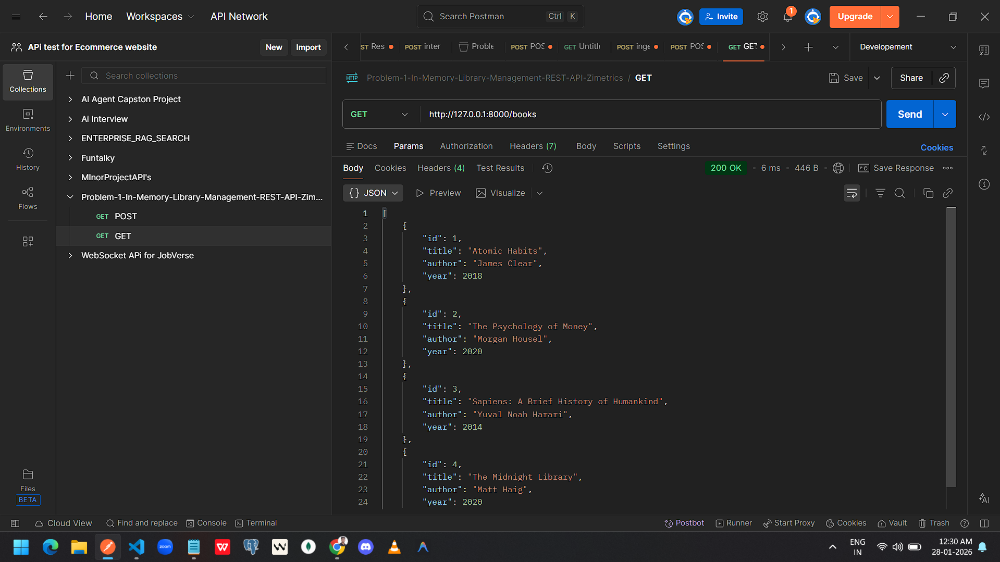
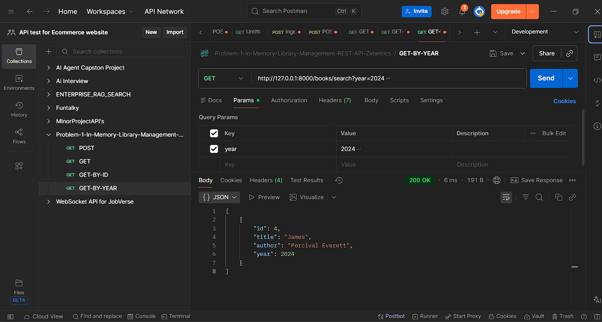
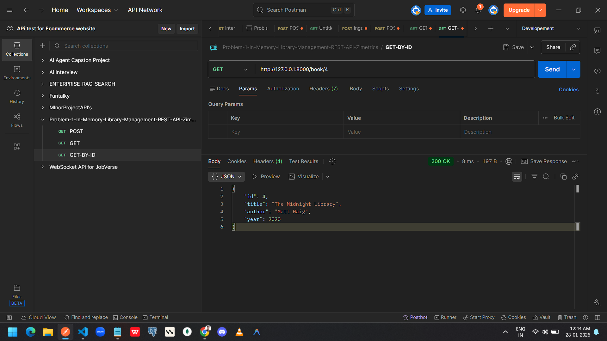
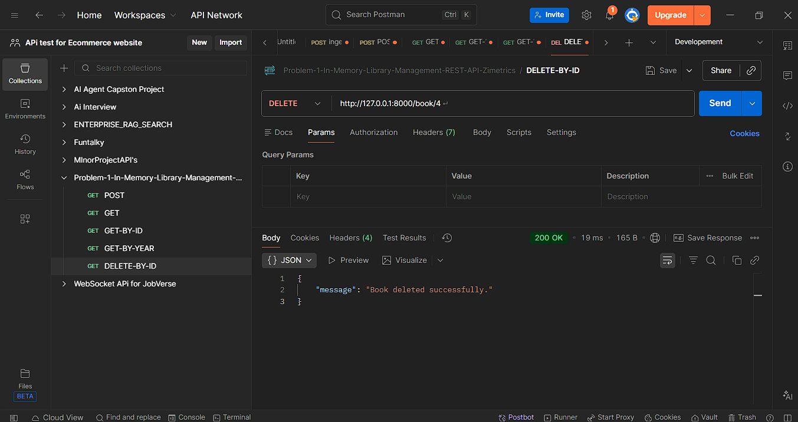

# 📚 In-Memory Library Management REST API

## Project Title & Goal
A REST API built with FastAPI that manages a library's book inventory using in-memory storage.

## Setup Instructions

```bash
git clone https://github.com/GautamSutar/Problem-1-In-Memory-Library-Management-REST-API-Zimetrics.git
cd Problem-1-In-Memory-Library-Management-REST-API-Zimetrics
pip install -r requirements.txt
uvicorn main:app --reload
```

Open in browser:
```
http://127.0.0.1:8000/

You will get this response it means Server running correct 
{
    "message": "In-Memory Library API Running"
}
```

## The Logic (How I Thought)
I used a Python dictionary as in-memory storage because it is fast and matches the problem requirement of not using a database. FastAPI was chosen because it is lightweight and automatically generates API documentation.

**Hardest Bug:** The search endpoint conflicted with the get-by-id route.

**Fix:** Placed `/books/search` before `/books/{id}` so FastAPI does not treat "search" as an ID.

## Output screenshotss

### POST – Add Book


### GET – All Books


### GET – Search Books by Year


### GET – Book By ID


### DELETE – Book By ID


## Future Improvements
* Add database support (PostgreSQL / SQLite)
* Add input validation
* Add authentication
* Add unit tests